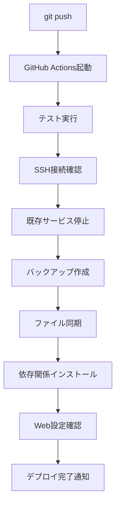

# 🚀 GitHub Actions 自動デプロイガイド

コミット→Push→デプロイまでの完全自動化設定手順です。

## ✅ 実装された機能

### 🎯 自動デプロイ機能
- **Pushで自動起動**: main/masterブランチへのプッシュで自動デプロイ
- **サービス自動停止**: デプロイ前に既存サービスを安全に停止
- **自動バックアップ**: デプロイ前に既存アプリケーションをバックアップ
- **依存関係自動インストール**: Python環境に合わせた柔軟なインストール
- **Web設定自動実行**: 初回のみWeb設定を自動実行
- **.env保護**: 既存の.envファイルは上書きされない

### 🔧 追加機能
- **手動実行オプション**: GitHub UIから手動でデプロイ実行可能
- **サービス再起動選択**: 手動実行時にサービス再起動の有無を選択
- **Markdownファイル除外**: READMEなどのドキュメント更新ではデプロイしない
- **エラーハンドリング**: 各ステップでエラーが発生しても継続

## 📋 設定手順

### 1. GitHub Secretsの設定

GitHubリポジトリで以下を設定：

```
1. リポジトリページ → Settings
2. 左メニュー → Secrets and variables → Actions
3. "New repository secret" ボタンクリック

Secret名: SAKURA_PASSWORD
値: [さくらインターネットのパスワード]
```

### 2. GitHubリポジトリの作成（まだの場合）

```bash
# ローカルで初期化
cd tag_generator
git init
git add .
git commit -m "Initial commit"

# GitHubでリポジトリ作成後
git remote add origin https://github.com/[あなたのユーザー名]/tag-generator.git
git branch -M main
git push -u origin main
```

### 3. .envファイルの保護

```bash
# .gitignoreに.envが含まれているか確認
cat .gitignore | grep .env

# 含まれていない場合は追加
echo ".env" >> .gitignore
git add .gitignore
git commit -m "Add .env to gitignore"
```

## 🚀 使用方法

### 自動デプロイ（推奨）

```bash
# 1. 変更をコミット
git add .
git commit -m "Update features"

# 2. プッシュ（自動デプロイ開始）
git push origin main

# 3. GitHub Actionsでデプロイ状況を確認
# https://github.com/[あなたのユーザー名]/tag-generator/actions
```

### 手動デプロイ

```
1. GitHubリポジトリ → Actions タブ
2. "🚀 Auto Deploy to Sakura Internet" を選択
3. "Run workflow" ボタンクリック
4. サービス再起動オプションを選択
5. "Run workflow" 実行
```

## 📊 デプロイフロー



## 🔧 カスタマイズ

### デプロイ除外パスの追加

`.github/workflows/deploy.yml` の `paths-ignore` を編集：

```yaml
on:
  push:
    branches: [ main, master ]
    paths-ignore:
      - '**.md'
      - 'docs/**'
      - '.gitignore'
      - 'tests/**'  # テストファイルも除外
      - '*.txt'     # テキストファイルも除外
```

### Python バージョン変更

```yaml
- name: 🐍 Setup Python
  uses: actions/setup-python@v4
  with:
    python-version: '3.9'  # お好みのバージョンに
```

### デプロイ先変更

```yaml
env:
  REMOTE_HOST: your-server.com
  REMOTE_USER: your-username
  REMOTE_PATH: /path/to/app
```

## 🔍 デプロイ状況確認

### GitHub Actions画面

```
https://github.com/[あなたのユーザー名]/tag-generator/actions
```

### ログ確認コマンド

```bash
# デプロイ後のログ確認
ssh mokumoku@mokumoku.sakura.ne.jp
cd /home/mokumoku/www/tags
tail -f logs/service.log

# サービス状況確認
./status_tag_generator.sh
```

## 🚨 トラブルシューティング

### 問題1: Permission denied (publickey,password)

**原因**: GitHub SecretのSAKURA_PASSWORDが正しくない

**解決方法**:
```
GitHub → Settings → Secrets → SAKURA_PASSWORD を更新
```

### 問題2: rsync error

**原因**: ファイル権限の問題

**解決方法**:
```bash
ssh mokumoku@mokumoku.sakura.ne.jp
chmod -R 755 /home/mokumoku/www/tags
```

### 問題3: Service failed to start

**原因**: 依存関係のインストール失敗

**解決方法**:
```bash
ssh mokumoku@mokumoku.sakura.ne.jp
cd /home/mokumoku/www/tags
source venv/bin/activate
pip install -r requirements.txt
```

### 問題4: Workflow not running

**原因**: ブランチ名が違う

**解決方法**:
```bash
# ブランチ名確認
git branch

# mainブランチに変更
git checkout -b main
git push -u origin main
```

## 🎯 ベストプラクティス

### 1. コミットメッセージ

```bash
# 良い例
git commit -m "feat: Add OAuth authentication"
git commit -m "fix: Resolve memory issue in batch processing"
git commit -m "docs: Update README"

# 悪い例
git commit -m "update"
git commit -m "fix bug"
```

### 2. デプロイ前確認

```bash
# ローカルでテスト実行
python -m pytest tests/

# 設定ファイル確認
cat .env

# 差分確認
git status
git diff
```

### 3. 緊急時の対応

```bash
# 自動デプロイを一時的に無効化
git push --no-verify

# ロールバック
ssh mokumoku@mokumoku.sakura.ne.jp
cd /home/mokumoku
cp -r backups/tag_generator_[timestamp] www/tags
```

## 📞 サポート

自動デプロイで問題が発生した場合：

1. **GitHub Actions ログ確認**
2. **SSH でサーバー状態確認**
3. **バックアップからの復元**

これで、**git push** するだけで自動的にさくらインターネットにデプロイされます！