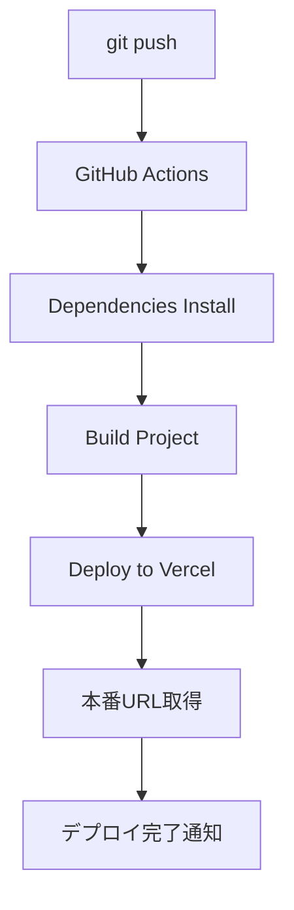

# 🔐 GitHub Secrets設定ガイド

Vercel自動デプロイのためのGitHub Secrets設定方法

## 📋 必要なSecrets

以下のSecretsをGitHubリポジトリに設定してください：

### 1. VERCEL_TOKEN
**取得方法：**
1. Vercelダッシュボード → Settings → Tokens
2. 「Create Token」をクリック
3. 名前を入力（例: `github-actions`）
4. Scopeを選択: `Full Account`
5. トークンをコピー

### 2. VERCEL_ORG_ID
**取得方法：**
1. ローカルでVercel CLIインストール: `npm i -g vercel`
2. プロジェクトディレクトリで: `vercel link`
3. `.vercel/project.json`ファイルを確認
4. `orgId`をコピー

### 3. VERCEL_PROJECT_ID
**取得方法：**
1. 上記と同じ`.vercel/project.json`ファイル
2. `projectId`をコピー

## ⚙️ GitHub Secrets設定手順

### 1. GitHubリポジトリにアクセス
```
https://github.com/horiken1977/tag-generator
```

### 2. Settings → Secrets and variables → Actions

### 3. 「New repository secret」で以下を追加:

```
名前: VERCEL_TOKEN
値: [Vercelから取得したトークン]

名前: VERCEL_ORG_ID  
値: [.vercel/project.jsonのorgId]

名前: VERCEL_PROJECT_ID
値: [.vercel/project.jsonのprojectId]
```

## 🔧 Vercel CLI設定方法

ローカルでのVercel設定：

```bash
# Vercel CLIインストール
npm install -g vercel

# nextjs-appディレクトリに移動
cd nextjs-app/

# Vercelプロジェクトとリンク
vercel login
vercel link

# プロジェクト情報確認
cat .vercel/project.json
```

`.vercel/project.json`の例：
```json
{
  "orgId": "team_xxxxxxxxxxxxxxxxx",
  "projectId": "prj_xxxxxxxxxxxxxxxxx"
}
```

## 🚀 自動デプロイの動作

### Mainブランチへのプッシュ
- ✅ 本番環境にデプロイ
- ✅ `nextjs-app/`配下の変更を検知
- ✅ 自動ビルド・テスト・デプロイ

### プルリクエスト作成
- ✅ プレビュー環境にデプロイ
- ✅ PRにプレビューURLをコメント
- ✅ レビュー前にテスト可能

### 手動実行
- ✅ GitHub ActionsのWorkflowページから手動実行可能

## 📊 デプロイフロー



## ✅ 設定確認方法

1. **Secrets設定完了後：**
   ```bash
   git add .
   git commit -m "Setup Vercel auto-deploy"
   git push origin main
   ```

2. **GitHub Actionsページで確認：**
   - Actions タブで実行状況確認
   - デプロイログをチェック

3. **Vercelダッシュボードで確認：**
   - デプロイ履歴確認
   - 本番URLアクセステスト

## 🔗 参考リンク

- [Vercel CLI Documentation](https://vercel.com/docs/cli)
- [GitHub Actions Documentation](https://docs.github.com/en/actions)
- [Vercel GitHub Integration](https://vercel.com/docs/git/vercel-for-github)

設定完了後、自動的にコミット→プッシュ→Vercelデプロイが実行されます！